# 🧭 ULTRALEARNING ROADMAP
**Goal:** Build a gamified learning platform with a 2D/3D animation tool and course editor  
**Schedule:**  
- Mon–Thu → 1h Non-Software | 2–3h Software  
- Fri–Sun → Teach, Write, and Plan

| Stage | Focus | Non-Software Resource(s) | Software Resource(s) | Prerequisites | Status | Notes |
|-------|--------|---------------------------|----------------------|----------------|--------|-------|
| **1** | Language & Programming Foundations | Khan Academy Grammar | Rust Experiment Book | None | ⏳ | Build clarity and Rust fundamentals |
| **2** | Arithmetic & Software Habits | Khan Arithmetic → Pre-Algebra → Algebra → Geometry & Measurement | Pro Git + Software Engineering at Google | Stage 1 |  | Strengthen reasoning + engineering discipline |
| **3** | Problem Solving & Algorithmic Thinking | Serge Lang – Basic Mathematics → George Pólya – How to Solve It | Grokking DSA → Grokking Algorithms | Stage 2 |  | Build algorithmic and abstract reasoning |
| **4** | Calculus & Software Architecture | Pre-Calculus → Calculus Made Easy | Dive Into Design Patterns → UML Distilled | Stage 3 |  | Understand motion + reusable architectures |
| **5** | Logic & Data Persistence | Introduction to Logic (or Thinking Mathematically) → Essence of Linear Algebra (3Blue1Brown) | Postgres Fundamentals → Database System Concepts | Stage 4 |  | Formal logic + database foundations |
| **6** | Operating Systems & Continuous Delivery | Operating Systems: Three Easy Pieces (OSTEP) | Docker Basics → Continuous Delivery (Jez Humble) | Stage 5 |  | Processes, containers, automated builds |
| **7** | Networking & System Design | Computer Networking: A Top-Down Approach (or Beej’s Guide) | System Design Interview Vol 1 → Vol 2 | Stage 6 |  | Communication protocols + architecture |
| **7.5** | DevOps Foundations (Automation & Infrastructure) | The Phoenix Project | Terraform Up & Running → Kubernetes in Action → AWS/GCP Basics | Stage 7 |  | Infrastructure as code + orchestration |
| **8** | DevOps Deep Dive (Monitoring & DevSecOps) | Practical DevSecOps (or OWASP DevSecOps Guide) | Prometheus: Up & Running → extend Continuous Delivery → Docker Security Best Practices | Stage 7.5 |  | Monitoring, metrics, CI/CD security |
| **9** | Application & Systems Security | Security Engineering – Ross Anderson | Web Application Hacker’s Handbook → OWASP Top 10 → Practical Cryptography for Developers → Docker Security Best Practices (revisit) | Stage 8 |  | Secure coding, encryption, API hardening |
| **10** | Data-Intensive & Distributed Systems | The Craft of Research → Research Methods for Engineers | Designing Data-Intensive Applications → Distributed Systems (Tanenbaum) | Stage 9 |  | Scalability, replication, communication |
| **11** | Physics & 3D Mathematics for Graphics | Fundamentals of Physics → 3D Math Primer → Applied Physics (optional) | Rive Basics → Flutter Animation Basics | Stage 10 |  | Motion, vectors, 2D/3D animation logic |
| **12** | 3D Pipeline & Creative Integration (optional) | Blender Fundamentals (tutorial series) | Integrate Rust logic + Flutter UI + Rive/Blender assets | Stage 11 |  | 3D asset workflow and visual integration |
| **13** | Capstone & Teaching | Research / Writing / YouTube Teaching (continuous) | Gamified Learning Platform Project (Flutter + Rust + Postgres + Rive + CI/CD) | All previous stages |  | Build and teach your complete platform |

---

### ✅ Tracker Tips
- **Status legend:** ⏳ In Progress | ✅ Completed | 🕓 Planned  
- Add optional columns: *Start Date*, *End Date*, *Output (Project/Video/Article)*  
- Review every 4 weeks → teach what you learned on Fri–Sun

```mermaid
flowchart TB
subgraph S1["Stage 1 - Foundations"]
    s1n["Grammar"] --> s1s["Rust"]
end
subgraph S2["Stage 2 - Arithmetic & Habits"]
    s2n["Arithmetic Algebra Geometry"] --> s2s["ProGit & SE@Google"]
end
subgraph S3["Stage 3 - Problem Solving"]
    s3n["BasicMath & HowToSolve"] --> s3s["DSA & Algorithms"]
end
subgraph S4["Stage 4 - Calculus & Design"]
    s4n["PreCalc & Calculus"] --> s4s["DesignPatterns & UML"]
end
subgraph S5["Stage 5 - Logic & DB"]
    s5n["Logic & LinearAlgebra"] --> s5s["Postgres & DBConcepts"]
end
subgraph S6["Stage 6 - OS & Delivery"]
    s6n["OSTEP"] --> s6s["Docker & ContinuousDelivery"]
end
subgraph S7["Stage 7 - Networking & Design"]
    s7n["Networking"] --> s7s["SystemDesign"]
end
subgraph S8["Stage 8 - DevOps Foundations"]
    s8n["PhoenixProject"] --> s8s["Terraform K8s Cloud"]
end
subgraph S9["Stage 9 - DevOps Deep Dive"]
    s9n["DevSecOps Principles"] --> s9s["Monitoring & Pipeline Security"]
end
subgraph S10["Stage10 - Security"]
    s10n["Security Engineering"] --> s10s["WebSec & Crypto"]
end
subgraph S11["Stage11 - Distributed Systems"]
    s11n["Research Methods"] --> s11s["DataIntensive & Distributed"]
end
subgraph S12["Stage12 - Physics & Animation"]
    s12n["Physics & 3DMath"] --> s12s["Rive & Flutter Anim"]
end
subgraph S13["Stage13 - Capstone"]
    s13n["Research & Teaching"] --> s13s["GamifiedPlatform"]
end

s1n --> s1s --> s2n --> s2s --> s3n --> s3s --> s4n --> s4s --> s5n --> s5s --> s6n --> s6s --> s7n --> s7s --> s8n --> s8s --> s9n --> s9s --> s10n --> s10s --> s11n --> s11s --> s12n --> s12s --> s13n --> s13s
```

