```mermaid
flowchart TB
subgraph S1["Stage 1 - Foundations"]
    s1n["Grammar"] --> s1s["Rust"]
end
subgraph S2["Stage 2 - Arithmetic & Habits"]
    s2n["Arithmetic Algebra Geometry"] --> s2s["ProGit & SE@Google"]
end
subgraph S3["Stage 3 - Problem Solving"]
    s3n["BasicMath & HowToSolve"] --> s3s["DSA & Algorithms"]
end
subgraph S4["Stage 4 - Calculus & Design"]
    s4n["PreCalc & Calculus"] --> s4s["DesignPatterns & UML"]
end
subgraph S5["Stage 5 - Logic & DB"]
    s5n["Logic & LinearAlgebra"] --> s5s["Postgres & DBConcepts"]
end
subgraph S6["Stage 6 - OS & Delivery"]
    s6n["OSTEP"] --> s6s["Docker & ContinuousDelivery"]
end
subgraph S7["Stage 7 - Networking & Design"]
    s7n["Networking"] --> s7s["SystemDesign"]
end
subgraph S8["Stage 8 - DevOps Foundations"]
    s8n["PhoenixProject"] --> s8s["Terraform K8s Cloud"]
end
subgraph S9["Stage 9 - DevOps Deep Dive"]
    s9n["DevSecOps Principles"] --> s9s["Monitoring & Pipeline Security"]
end
subgraph S10["Stage10 - Security"]
    s10n["Security Engineering"] --> s10s["WebSec & Crypto"]
end
subgraph S11["Stage11 - Distributed Systems"]
    s11n["Research Methods"] --> s11s["DataIntensive & Distributed"]
end
subgraph S12["Stage12 - Physics & Animation"]
    s12n["Physics & 3DMath"] --> s12s["Rive & Flutter Anim"]
end
subgraph S13["Stage13 - Capstone"]
    s13n["Research & Teaching"] --> s13s["GamifiedPlatform"]
end

s1n --> s1s --> s2n --> s2s --> s3n --> s3s --> s4n --> s4s --> s5n --> s5s --> s6n --> s6s --> s7n --> s7s --> s8n --> s8s --> s9n --> s9s --> s10n --> s10s --> s11n --> s11s --> s12n --> s12s --> s13n --> s13s
```

# The Gamified Ultra-learning Project

<!-- TOC -->

- [The Gamified Ultra-learning Project](#the-gamified-ultra-learning-project)
    - [Phase 1  — Foundations of Software Engineering + Mental Maths](#phase-1---foundations-of-software-engineering--mental-maths)
        - [Phase 1 Books & Resources](#phase-1-books--resources)
        - [Phase 1 App Milestone](#phase-1-app-milestone)
    - [Phase 2  — DSA System design and more maths](#phase-2---dsa-system-design-and-more-maths)
        - [Phase 2 Books and Resources](#phase-2-books-and-resources)
        - [Phase 2 App Milestones](#phase-2-app-milestones)
    - [Phase 3 Pre-Calculus, Calculus, and more Software Crafting](#phase-3-pre-calculus-calculus-and-more-software-crafting)
        - [Phase 3 books and resources](#phase-3-books-and-resources)
        - [Phase 3 App Milestones](#phase-3-app-milestones)
    - [Phase 4 3D Math + Physics](#phase-4-3d-math--physics)
        - [Phase 4 Books & Resources](#phase-4-books--resources)
        - [Phase 4 App milestones](#phase-4-app-milestones)
    - [Phase 5 Cooking physics and research](#phase-5-cooking-physics-and-research)
        - [Phase 5 Books and resources](#phase-5-books-and-resources)
        - [Phase 5 app milestones](#phase-5-app-milestones)
    - [Study Guide](#study-guide)
        - [Daily time management](#daily-time-management)

<!-- /TOC -->
<!-- /TOC -->

## Phase 1  — Foundations of Software Engineering + Mental Maths

🥅 Goal: Build a solid MVP of your gamified app while sharpening your fundamentals.
Everything you learn becomes directly integrated into the app as gamified modules.

### Phase 1 Books & Resources

- [ ] [The Rust Programming Language](https://rust-book.cs.brown.edu/experiment-intro.html)  <progress id="progressBar" max="22" value="1"></progress>

- [ ] Refactoring: Improving the Design of Existing Code — Martin Fowler
- [ ] Software Engineering at Google — Titus Winters, Tom Manshreck, Hyrum Wright
- [ ] Dive Into Design Patterns: A modern eBook on design patterns and principles.
- [ ] [Refactoring guru course](https://refactoring.guru/course)
- [ ] Postgres fundamentals tutorial
- [ ] Database System Concepts
- [ ] [Docker basics](https://docker-curriculum.com/)
- [ ] Continuous Delivery: Reliable Software Releases through Build, Test, and Deployment Automation — Jez Humble & David Farley
- [ ] pro git
- [ ] mental maths
- [ ] Rive basics and flutter animation basic
- [ ] flutter flame tutorial
- [ ] Actionable Gamification — Yu-kai Chou
- [ ] Hooked — Nir Eya
- [ ] Game Feel — Steve Swink

### Phase 1 App Milestone

- [ ] 🎮 MVP of gamified app → now influenced by Actionable Gamification + Hooked
- [ ] 📘 First gamified module: Mental Maths game
- [ ] 🏗️ App core engineered using solid SE principles (design patterns, clean code, refactoring mindset)
- [ ] 🗄️ Backend in Rust with database (PostgreSQL) + gRPC/REST APIs
- [ ] 🧩 Modular design so future topics (DSA, algebra, etc.) plug in easily
- [ ] 🚀 CI/CD pipeline with automated tests + secure deployments

## Phase 2  — DSA System design and more maths

🥅 Goal: Deepen your CS knowledge, maths and expand app modules.

### Phase 2 Books and Resources

- [ ] [Grammar, Arithmetic, Basic geometry and measurement, Algebra basics  (khan academy)](https://www.khanacademy.org/profile/me/courses)
- [ ] Serge Lang’s Basic Mathematics
- [ ] George Pólya’s How to Solve It
- [ ] Susanna Epp — Discrete Mathematics with Applications  
- [ ] Grokking Data Structures — Educative.io course/book
- [ ] Grokking Algorithms — Aditya Bhargava
- [ ] UML Distilled: A Brief Guide to the Standard Object Modeling Language — Martin Fowler
- [ ] System Design Interview: An Insider’s Guide Vol. 1 — Alex Xu
- [ ] System Design Interview: An Insider’s Guide Vol. 2 — Alex Xu
- [ ] Designing Data-Intensive Applications: The Big Ideas Behind Reliable, Scalable, and Maintainable Systems — Martin Kleppmann
- [ ] Don’t Make Me Think — Steve Krug (for better UX as you add complex modules)
- [ ] Rosen — Discrete Mathematics and Its Application (optional)
- [ ] Introduction to Algorithms (CLRS) — reference for advanced algo depth

### Phase 2 App Milestones

- [ ] 🎮 Add DSA module
- [ ] 🎮 Add Pre-calculus & Calculus gamified modules (limits, derivatives, integrals visualized with Rive animations)
- [ ] 🎮 Add gamified design patterns module (turn SE patterns into puzzles/quests)
- [ ] ⚡ Improve app performance using learned algorithms
- [ ] 🛡️ improve project architecture
- [ ] 🌐 Deploy scalable backend features (queues, caching)
- [ ] Expand gamification logic: leaderboards, streaks, badges → powered by what you learned in Yu-kai Chou + Kleppmann.

## Phase 3 Pre-Calculus, Calculus, and more Software Crafting

🥅 Goal: Advance into math needed for graphics/physics while maturing engineering practices.

### Phase 3 books and resources

- [ ] The Pragmatic Programmer — Andrew Hunt & David Thomas (optional)
- [ ] The Software Craftsman: Professionalism, Pragmatism, Pride — Sandro Mancuso (optional)
- [ ] Distributed Systems: Principles and Paradigms — Andrew S. Tanenbaum, Maarten Van Steen

- [ ] Pre-calculus Mathematics in a Nutshell — George F. Simmons
- [ ] Calculus Made Easy — Silvanus P. Thompson

### Phase 3 App Milestones

- [ ] 🎮 Add Pre-calculus & Calculus gamified modules (limits, derivatives, integrals visualized with Rive animations)
- [ ] 🎮 Add gamified design patterns module (turn SE patterns into puzzles/quests)

## Phase 4 3D Math + Physics

🥅 Goal: Preparation for Physics and simulations

### Phase 4 Books & Resources

- [ ] 3D Math Primer for Graphics and Game Development — Fletcher Dunn & Ian Parberry
- [ ] Fundamentals of Physics — David Halliday, Robert Resnick, Jearl Walker

### Phase 4 App milestones

- [ ] 🎮 Add 3D math gamified module (vectors, matrices, transformations with visual animations)
- [ ] 🎮 Add Physics gamified module (forces, motion, energy simulated interactively)

## Phase 5 Cooking physics and research

🥅 Goal: Learn physics, how to research and add more more physics modules

### Phase 5 Books and resources

- [ ] Physics for Scientists and Engineers — Raymond A. Serway
- [ ] Applied Physics — Dale Ewen, Neill Schurter, P. Erickson
- [ ] The Craft of Research — Wayne Booth, Gregory Colomb, Joseph Williams
- [ ] Research Methods for Engineers — David V. Thiel

### Phase 5 app milestones

- [ ] 🎮 Add applied physics module (electricity, waves, thermodynamics gamified)
- [ ] 🎮 Add research literacy module (teach problem-solving & scientific method in gamified way)
- [ ] 🌐 Grow app into multi-platform product with paid tiers + community features
- [ ] ⚒️ Keep improve app modules

## Study Guide

### Daily time management

- Dedicate 3 hours a day every day.

  For practical resource, use the following strategy:

  > learn (50 mins) --> break(10 mins) --> practice (80 mins) --> break(10 mins) --> review (30 mins)
>

- for theory resources:

  > learn (25 mins) --> break (5 mins) --> learn (25 mins) --> break (5 mins) --> \
  learn (25 mins) --> break (5 mins) --> learn (25 mins) --> break (5 mins) --> \
  learn (25 mins) --> break (5 mins) --> review (25 mins)

- Use Sundays for reflection and Dev-log
  > review resource 1 (30 mins) --> dev log (50 min) --> \
  break (10 mins) --> \
  review resource 2 (30 mins) --> dev log (50 min)

